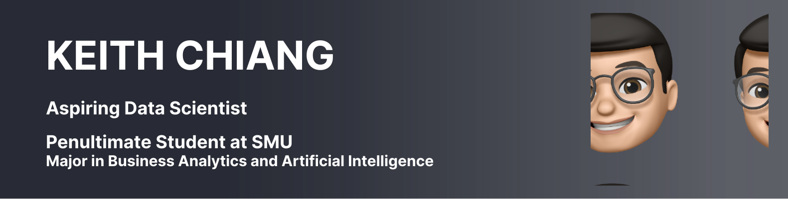

 
# Hey there 👋 

 <ul>
  <li> Currently working on <b>2 Machine Learning Projects</b> for <b>AY2021-22 Term 1</b> </li>
  <ul>
    <li> CS421 Machine Learning → Predict Customer's Intent based on Website Browsing</li>
    <li> IS424 Data Mining & Biz Analytics → Predict Consumer Loan Default</li>
  </ul>
</ul>

<ul>
  <li>Learning/practicing on <b>Data Science Python Libraries</b> </li>
  <ul>
  <li> Pandas, Numpy </li>
  <li> Seaborn </li>
  <li> TensorFlow 2 </li>
  </ul>
</ul>

- 📄 Looking for opportunities in the field of Data Science!<a href="https://drive.google.com/uc?export=download&id=1QnQD9uPesFb2U1iRlrtBNQd6qycy6Z3D"> My Resume</a>
- 📫 You may reach me at <a href="mailto:keithchiang.gw@gmail.com">my email</a>

<h3 align="left">Connect with me</h3>

